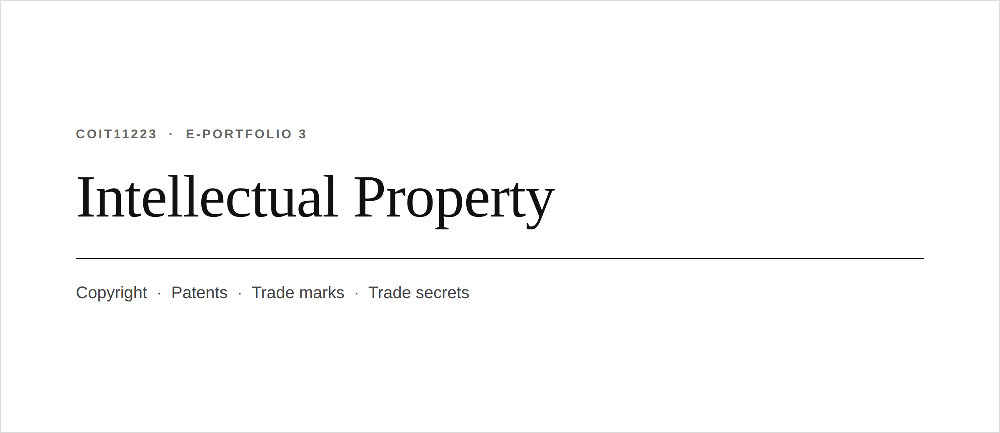
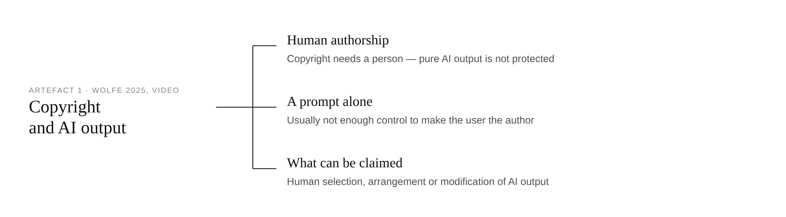
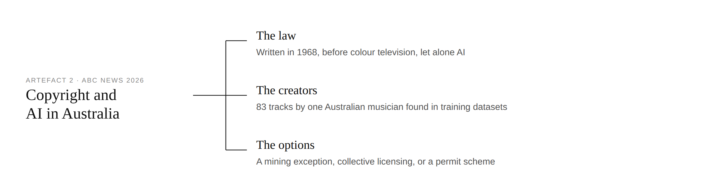
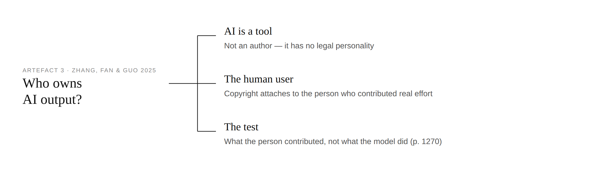
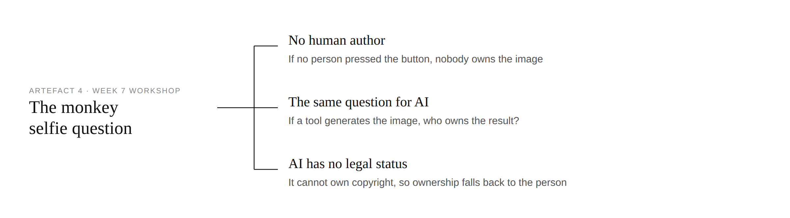
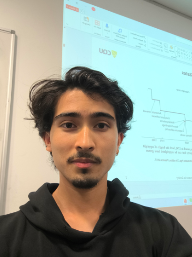

# e-Portfolio 3 – Intellectual Property

A collection of artefacts that demonstrate what I have learnt about Intellectual Property this week.

---

## Artefact 1: A YouTube video I found this week

<https://www.youtube.com/watch?v=1A74lC0tHH0>

### Summary of the artefact

On the day the US Copyright Office published its report on the copyright eligibility of works created using artificial intelligence, Wolfe (2025) critiqued the report. There is no need for any new legislation, according to the copyright office. A human being needs to be an author of the work, and the output that is generated solely from a model is not eligible. Typing prompts also does not count as enough control over the process. However, choosing, arranging, or altering the output is protected.

### Reasoning behind the choice of the artefact

The video format worked best for me since I wanted someone to explain the report to me before I started working on any of the material that would otherwise have been lawyer speak, and the description provided links directly to the source. However, neutral the description may seem, the channel operates for the benefit of the people using AI tools on a regular basis, and what they save becomes more important than what artists lose.

---

## Artefact 2: A news article I found this week

<https://www.abc.net.au/news/2026-07-14/copyright-law-battleground-in-australia-ai-boom/106891890>

### Artefact summary

As per Wilson (2026), the main problem in the debate about AI money in Australia is a copyright act from 1968. Anthropic has linked its plans for a data centre in this region to the settlement of the copyright issue. On the other side of this controversy, George Nicholas, a mixing engineer, found 83 songs of his band included in training datasets, and APRA AMCOS says that no platform has ever held serious talks with Australian rights holders.

### Justification for choosing this artefact

Since nothing here is settled, I have chosen it instead of solved worked examples. The 83 songs have made this theoretical controversy concrete. In my second read, I have noticed the bias, as money comes first, creators are discussed less, and licensing does not cost anyone anything. Since there is no decision by Australian court yet, all of it is forecasted.

---

## Artefact 3: Scholarly article

<https://doi.org/10.1017/glj.2026.10190>

### Summary of the Artefact

Following the approach to the question of the copyright of AI-generated works set by Li v Liu, Zhang, Fan and Guo in the Beijing Internet Court, Zhang, Fan, and Guo (2025, p. 1268) answer the question at hand by treating the model as a tool rather than as a creator and thus assigning copyright to its user who has put something into the model, regardless of what. "It is not about the contribution of generative AI but about the contribution of the human user" (Zhang, Fan & Guo 2025, p. 1270).

### Reasons for Choosing the Artefact

What intrigued me was not a general warning but the actual use of the principle at hand in the case study. To state it is much easier than to apply it. Where does real intellectual labour start? The authors never define the dividing line or who has to draw it. And, indeed, this is a single case from China that is not legally binding anywhere else.

---

## Artefact 4: Workshop Personal Reflection

### Reflection on the artefact: My personal reflection

It made an impression when a monkey presses a shutter and becomes the copyright holder. It appears funny at first glance until you think about it; authorship is a human feature, meaning without a person who pressed the shutter, there is no ownership at all. After this came the question that I wanted to know the answer to. If I ask a model for a picture, to whom does this picture belong?

### Justification on why I chose the artefact

It caught my attention in the following way; since the tools lack legal status, they are not copyrightable, meaning that the ownership falls on the input provided by the person. It seems to me that we solved the problem much too quickly in our class. There is a more difficult problem of who owns the training dataset on which this picture was based, and my solution is valid only while courts define AI as a tool.

---

# Use of AI in preparing this e-portfolio

The assistance of the AI was utilized in the planning and researching process only. The AI was used in order to find a topic, choose search words to look up the latest information on Australia, and to make sure that the selected artefacts were published in 2024 and onwards. I read each artefact personally, verified the information and page number with the primary source, and summarized, justified, and reflected on each artefact by myself. All images in this portfolio are my own creations, based on the notes in the workshops and on the artefacts.

# References in CQU Harvard Style

Wilson, C 2026, 'Copyright law is now the biggest battleground in Australia's AI boom', ABC News, 14 July 2026, viewed 1 September 2026, https://www.abc.net.au/news/2026-07-14/copyright-law-battleground-in-australia-ai-boom/106891890

Wolfe, M, Here's what you can and can't copyright with AI, video, 29 January 2025, viewed 3 September 2026, https://www.youtube.com/watch?v=1A74lC0tHH0

Zhang, X, Fan, J & Guo, D 2025, 'Digital alchemy? Rethinking copyright in the age of AI-generated content: lessons and reflections from the AI value chain', German Law Journal, vol. 26, no. 7, DOI: https://doi.org/10.1017/glj.2026.10190
